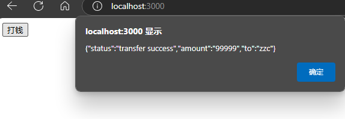
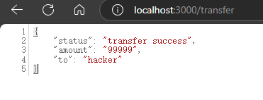
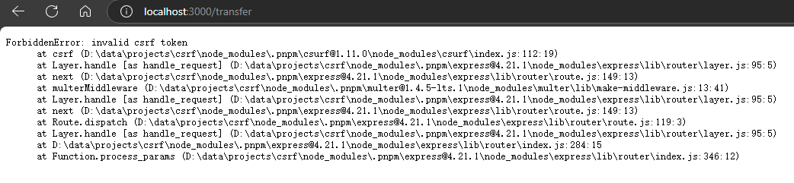

## 简介

本 `DEMO` 是一个对 `CSRF` 攻击的模拟与对 `CSRF TOKEN` 的使用的一个学习记录。

在浏览器隐私模式下访问。

## 模拟 CSRF 攻击

~~~bash
npm run start
~~~

首先访问 http://localhost:3000 打开主站，在浏览器留下登录 `cookie`，点击“打钱”按钮以发送转账相关业务请求。

接着访问 http://localhost:8080/forgery.html 打开伪造请求的页面，可以看到资金被转移到了攻击者的账户中。

## 模拟 CSRF TOKEN 验证

关闭当前浏览器隐私模式窗口并重新打开隐私模式。

~~~bash
npm run start-protect
~~~

首先继续访问 http://localhost:3000 打开主站，以在浏览器留下登录 `cookie`。

接着访问 http://localhost:8080/forgery.html 打开伪造请求的页面，可以看到因为没有通过 `CSRF TOKEN` 验证，导致业务操作被拒绝。

